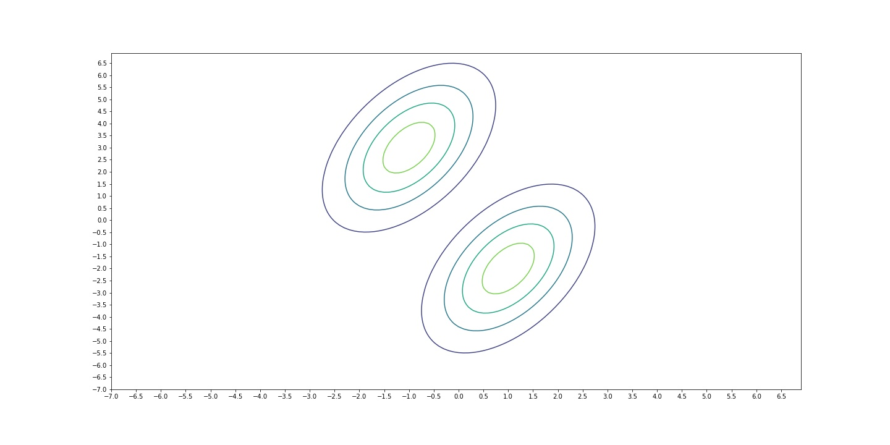
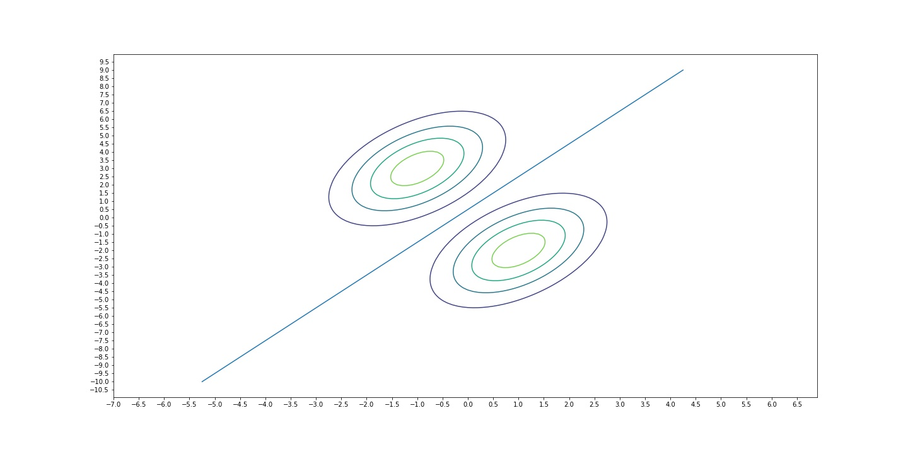

Two Different Probabilistic Approaches Towards Classsification
==============================================================

There are two main approaches in classification: Generative approach and
discriminative approach. A generative model is used to model the joint
probability distribution, $P(X, Y)$, whereas a discriminative model is
used to model $P(Y | X = x)$.

Logically, what this means is Generative learning algorithms model the
probability distribution of different classes and Discriminative
learning algorithms models the boundaries between classes.

For example, if we want to classify an animal as a dog or a cat in some
population sample of dogs and cats, a Generative learning algorithms
would model two probability distributions for dogs and cats based on the
features of dogs and cats. And when a new example comes in, it labels
that example by calculating the probability based on the two
distributions and choosing the outcome that has the greatest
probability. What a Discriminative learning algorithm would do in this
case is calculating the outcome of some decision function and labels the
new example based on that outcome. So, generative models tries to model
what cats and dogs would look like and discriminative models only decide
whether an example is a cat or a dog.

Logistic Regression and Support Vector Machines can be given as members
of Discriminative Learning algorithms. Linear Discriminant Analysis,
Quadratic Discriminant Analysis and Naive Bayes Classifier are examples
of Generative Learning algorithms.

**Remark:** Because Generative learning algorithms models each class’ population, it can be used to generate new examples whereas Discriminative learning algorithms don’t have this capability

Because Generative learning algorithms models each class' population, it
can be used to generate new examples whereas Discriminative learning
algorithms don't have this capability.

Gaussian Discriminant Analysis
==============================

Linear Discriminant Analysis and Quadratic Discriminant Analysis are
sub-branches of Gaussian Discriminant Analysis. In Linear Discriminant
Analysis, different classes share the same covariance matrix, whereas in
Quadratic Discriminant Analysis all classes have different covariance
matrices.

GDA (Gaussian Discriminant Analysis) assumes all features are normally
distributed. Multivariate Gaussian distribution is written as:

$$
P(x | y\_i) = \frac{1}{ (2 \pi )^{n/2} | \Sigma\_i |^{1/2}}exp{[- \frac{1}{2}(x-\mu\_{y\_i})^{T}\Sigma\_i^{-1}(x-\mu\_{y\_i})]}  \tag{1}
$$

For simplicity, let us assume that the response variable, $y\_i$, is
binary, i.e $ y\_i \in \\{0, 1 \\} $. So, $ y\_i $'s are Bernoulli
distributed. Therefore $P(Y = y\_i)$ can be written as:
$$P(Y = y\_i) = \phi^{y\_i}(1-\phi)^{1-y\_i} \tag{2}$$

With these in mind, we can write the joint probability distribution
$P(X, Y)$ as:

$$P(X, Y) = P(X | Y = 0)P(Y = 0) + P(X | Y = 1)P(Y = 1)  \tag{3}$$

Then we can write the log-likelihood of the data as:
$$l(\phi, \mu\_0, \mu\_1, \Sigma\_i) = \log\prod\limits\_{i = 1}^m p(x^{(i)}, y^{(i)}; \phi, \mu\_0, \mu\_1, \Sigma\_i)$$

$$= \log\prod\limits\_{i = 1}^m p(x^{(i)} | y^{(i)}; \mu\_0, \mu\_1, \Sigma\_i)p(y^{(i)}; \phi) \tag{4}$$

Linear Discriminant Analysis
----------------------------

At this point, if we decide that each class shares the same covariance
matrix, then what we do is Linear Discriminant Analysis. Reason why this
is called this way is, in LDA, decision boundary between classes is
linear. Covariance matrix, $\Sigma$ of a multivariate Gaussian
distribution determines the orientation of the distribution. Becasue
each distribution has the same covariance matrix, they become
'parallel', meaning that they have the same orientation (like lines that
has the same slope). Therefore the curve that separates the two
distributions, *decision boundary*, becomes linear.

 

Log-likelihood of such a model is as follows:

$$l(\phi, \mu\_0, \mu\_1, \Sigma) = \log\prod\limits\_{i = 1}^m p(x^{(i)} | y^{(i)}; \mu\_0, \mu\_1, \Sigma)p(y^{(i)}; \phi) \tag{5}$$

$$= \sum\limits\_{i = 1}^m \log p(x^{(i)} | y^{(i)}; \mu\_0, \mu\_1, \Sigma) + \sum\limits\_{i = 1}^m \log p(y^{(i)}; \phi)$$

$$= \sum\limits\_{i = 1}^m\log\frac{1}{(2\pi)^{n/2}|\Sigma|^{1/2}}exp{[-\frac{1}{2}(x^{(i)}-\mu\_{y^{(i)}})^{T}\Sigma^{-1}(x^{(i)}-\mu\_{y^{(i)}})]} + \sum\limits\_{i = 1}^m \log \phi^{y^{(i)}}(1-\phi)^{(1-y^{(i)})}$$

$$= \sum\limits\_{i = 1}^m\log\frac{1}{(2\pi)^{n/2}|\Sigma|^{1/2}} + \sum\limits\_{i = 1}^m -\frac{1}{2}(x^{(i)}-\mu\_{y^{(i)}})^{T}\Sigma^{-1}(x^{(i)}-\mu\_{y^{(i)}}) + \sum\limits\_{i = 1}^m (y^{(i)}\log\phi + (1-y^{(i)})\log(1-\phi))  \tag{6}$$

If we maximize (6) by taking derivatives with respect to parameters $\mu\_0,
\mu\_1, \sigma, \Phi$   we find:

$$\phi = \frac{1}{m}\sum\limits\_{i=1}^{m} 1 \\{y^{(i)} = 1 \\} $$

$$\mu\_0 = \sum\limits\_{i=1}^{m} \frac{1\\{y^{(i)} = 0\\}x^{(i)}}{1\\{y^{(i)} = 0\\}}$$

$$\mu\_1 = \sum\limits\_{i=1}^{m} \frac{1\\{y^{(i)} = 1\\}x^{(i)}}{1\\{y^{(i)} = 1\\}}$$

$$\Sigma = \frac{1}{m}\sum\limits\_{i=1}^{m} (x^{(i)} - \mu\_{y^{(i)}})(x^{(i)} - \mu\_{y^{(i)}})^{T}$$

When we make prediction for a new example, we use Bayes' Rule:

$$p(x,y) = p(y|x)p(x) = p(x|y)p(y) \Rightarrow p(y|x) = \frac{p(x|y)p(y)}{p(x)}$$

To predict which class a new example should belong, we have to calculate
$P(Y = y^{(i)} | X = x^{(i)})$. Then, we choose the highest probability
and the corresponding class as a prediction. In a formal notation:

$$\underset{y}{\mathrm{argmax}}  p(y|x) = \underset{y}{\mathrm{argmax}}  \frac{p(x|y)p(y)}{p(x)} = \underset{y}{\mathrm{argmax}}  p(x|y)p(y)$$

We got rid of $p(x)$ because it's the same for all classes.

Let's examine the $P(X = x | Y = y^{(i)})P(Y = y^{(i)})$:

$$= \frac{1}{(2\pi)^{n/2}|\Sigma|^{1/2}}exp{[-\frac{1}{2}(x-\mu\_{y^{(i)}})^{T}\Sigma^{-1}(x-\mu\_{y^{(i)})}]}\phi^{y^{(i)}}(1-\phi)^{(1-y^{(i)})}$$

We can take the log of this equation to make things a little simpler.
Because we're looking for the $y^{(i)}$ that maximizes this equation,
taking the log won't change anything.

$$
\frac{1}{(2\pi)^{n/2}|\Sigma|^{1/2}}exp{[-\frac{1}{2}(x-\mu\_{y^{(i)}})^{T}\Sigma^{-1}(x-\mu\_{y^{(i)})}]}\phi^{y^{(i)}}(1-\phi)^{(1-y^{(i)})}
$$

$$= \log\frac{1}{(2\pi)^{n/2}|\Sigma|^{1/2}} + \log exp{[-\frac{1}{2}(x-\mu\_{y^{(i)}})^{T}\Sigma^{-1}(x-\mu\_{y^{(i)})}]} + \log \phi^{y^{(i)}}(1-\phi)^{(1-y^{(i)})}$$

$$= \log\frac{1}{(2\pi)^{n/2}|\Sigma|^{1/2}} -\frac{1}{2}(x-\mu\_{y^{(i)}})^{T}\Sigma^{-1}(x-\mu\_{y^{(i)}}) + \log \phi^{y^{(i)}}(1-\phi)^{(1-y^{(i)})}$$

The term $\log\frac{1}{(2\pi)^{n/2}|\Sigma|^{1/2}}$ is constant, because
it is same for all $y^{(i)}$'s, we can disregard it. Therefore, our
objective function that we want to maximize, reduces to:

$$y = \underset{y^{(i)}}{\mathrm{argmax}} (-\frac{1}{2}(x-\mu\_{y^{(i)}})^{T}\Sigma^{-1}(x-\mu\_{y^{(i)}}) + \log \phi^{y^{(i)}}(1-\phi)^{(1-y^{(i)})}) \tag{7}$$

Quadratic Discriminant Analysis
------------------------------

As opposed to LDA, if we decide that each class should have its own
covariance matrix, then this is Quadratic Discriminant Analysis. Because
each distribution has different covariance matrices, they have different
orientations and different distributions fails to be linearly separable.
That's why it is called 'Quadratic'. Covariance matrix of each
corresponding class is calculated as:

$$\Sigma\_k = \frac{\sum\limits\_{i=1}^{m} 1\\{y^{(i)} = y\_k \\} (x^{(i)} - \mu\_{y^{(i)}})(x^{(i)} - \mu\_{y^{(i)}})^{T}}{\sum\limits\_{i=1}^{m} 1\\{y^{(i)} = y\_k \\}}$$

where $y\_k \in \\{0, 1\\}$
