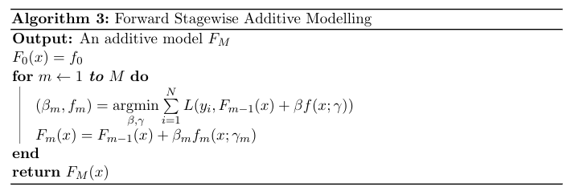
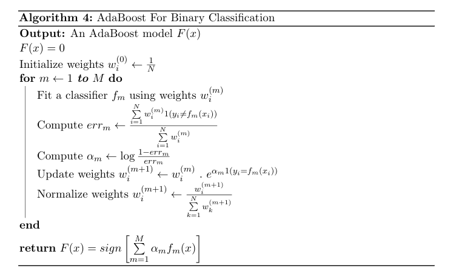
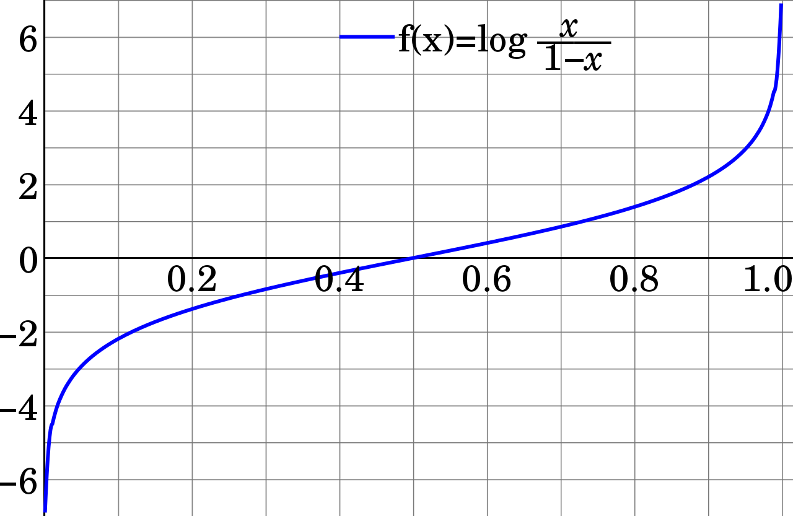

Boosting
--------

Boosting is an ensemble method that takes a weak learning algorithm and
builds a strong predictor in a forward stagewise fashion. It starts with
an initial guess $f\_0$, and iteratively adds new weak learners with the
objective of reducing the error of the current model. There are several
techniques for reducing the error. Some examples of error reducing
techniques are reweighting or resampling the training set so that the
new learner would be forced to focus on the examples with large errors
(hard examples). Other unique technique is Gradient Boosting, which
makes use of numerical optimization in the function space of weak
learners.

Boosting creates additive models. And it does that in an iterative way.
At each stage, a weak learner is built according to the current overall
model's errors. An additive model has the following form:
$$F(x) = f\_0 + f\_1(x) + \dots + f\_m(x) = f\_0 + \sum \limits\_{i=1}^{m}  f\_i(x) \tag{7}$$

Every $f\_i$ is the resulting function of a weak learner. Weak learner
might be a parametric regression model with small amount of parameters
or a small decision tree, etc.
$$
f\_i(\mathbf{x}; \mathbf{\theta\_i}) = \theta\_{i0} + \theta\_{i1} x_1 + \dots + \theta\_{in} x_n \tag{8}
$$

$$
f\_i(\mathbf{x}; \mathbf{w\_i}, \{ R\_j \}\_{j=1}^{J}) = \sum \limits\_{j=1}^{J} w_{ij} 1(\mathbf{x} \in R\_j) \tag{9}
$$

In equations (8) and (9), functions learned from linear regression and
decision trees are given, respectively. In (8), there is a linear
regression model with $n$ features. In (9), a decision tree model which
has $J$ terminal nodes (leaves) is given. Each region that corresponds
to a leaf is given as $R\_j$ and $w_{ij}$ is the prediction at the $j$th
leaf.

Each boosting technique is actually doing a forward stagewise additive
modelling which is iteratively improving our overall model with small
models by choosing a model which reduces our loss, $L$. Its general
algorithm is given below.

Now, let's talk about the AdaBoost algorithm.

AdaBoost
--------

AdaBoost is the first popular boosting algorithm. It uses multiple weak
learners which each weak learner focuses on the errors that the previous
weak learner has made. It does that by assigning weights to the
observations based on some error criterion. Resampling is also used
instead of weighting, which does random sampling but gives higher
probabilities to the hard examples in order to select the observations
which has greater error. We'll talk about the reweighting case.

It starts with a weak learner and weights $w\_i=\frac{1}{N}$ where $N$ is
the number of observations in our training set. After each stage,
weights are modified based on the errors of individual observations.
Observations with high errors have high weights whereas weights of the
observations that are correctly predicted are decreased. Next weak
learner is trained using those weights. Therefore, at each stage,
observations that are hard to predict correctly gets special treatment.

Now, let us formulate the AdaBoost for binary classification.

Let $F\_{m-1}$ denote the sum of the weak learned that are fitted in the
previous stages.
$$F\_{m-1}(\mathbf{x}) = f\_0 + f\_1(\mathbf{x}) + f\_2(\mathbf{x}) + \dots + f\_{m-2}(\mathbf{x}) + f\_{m-1}(\mathbf{x}) \tag{10}$$
where each $f\_i$ is a decision tree of the form given in (9).

Furthermore, let us define a loss function $L(y, f(x))$ where $y$ is the
ground truth and $f(x)$ is the prediction obtained through a boosted
model as in (10). Also, suppose that $y \in \{-1, 1\}$

AdaBoost uses exponential loss criterion which is defined as:

$$L(y, f(x)) = \exp{(-y f(x))} \tag{11}$$

At each stage, AdaBoost must solve:

$$(\beta\_m, f\_m) = \underset{\beta, f}{\operatorname{argmin}}
            \sum \limits\_{i=1}^{N} \exp(-y\_i (F\_{m-1}(x) + \beta f(x\_i))) \tag{12}$$

where $f\_m$ is the weak learner that is to be learned and $\beta\_m > 0$
is its coefficient which controls its influence in the overall model.

We can simplify the objective above as the following:

$$(\beta\_m, f\_m) = \underset{\beta, f}{\operatorname{argmin}}
            \sum \limits\_{i=1}^{N} w\_i^{(m)} \exp(-y\_i\beta f(x\_i))$$

where $w\_i^{(m)} = \exp(-y\_i F\_{m-1}(x))$. $w\_i^{m}$'s are not related
to $\beta$ and $f$, so we can see them as weights. Solution of this
objective involves two steps. First, for any $\beta$, we have:

$$f\_m(x) = \underset{f}{\operatorname{argmin}}
            \sum \limits\_{i=1}^{N} w\_i^{(m)} 1( \ y\_i \neq f(x\_i) \ )$$

Now let us find $\beta\_m$. We can further simplify the objective given
in (11) by separating the summation into two summations based on
$y\_i = f(x\_i)$ and $y\_i \neq f(x\_i)$. If $y = f(x)$, then
$exp(-yf(x)) = e^{-1}$, otherwise it is $e^{1}$. Therefore it can be
written as:

$$\ e^{-\beta} . \sum\limits\_{y\_i=f(x\_i)} w\_i^{(m)} +
        \ e^{\beta} . \sum \limits\_{y\_i \neq f(x\_i)} w\_i^{(m)}$$

To find the $\beta\_m$ that will minimizes this equation, we take
derivative with respect to $\beta$ and set it to zero:

$$\ -e^{-\beta} . \sum\limits\_{y\_i=f(x\_i)} w\_i^{(m)} +
        \ e^{\beta} . \sum \limits\_{y\_i \neq f(x\_i)} w\_i^{(m)} = 0$$

When we pull $\beta$ from the above equation, we find:

$$\beta\_m = \frac{1}{2} \log \frac{1 - err\_m}{err\_m}$$

where $$err\_m = \frac{
            \sum\limits\_{i=1}^{N} w\_i^{(m)} 1(y\_i \neq f\_m(x\_i))
        }{
            \sum\limits\_{i=1}^{N} w\_i^{(m)}
        }$$

Finally, we update our prediction as:

$$F\_m(x) = F\_{m-1}(x) + \beta\_m f\_m(x)$$

Also, recall that our weights were:

$$w\_i^{(m)} = exp(-y\_iF\_{m-1}(x))$$

In the next iteration, new weights will be:

$$
\begin{aligned}
            w\_i^{(m+1)} &= exp(-y\_iF\_m(x\_i)) \\\\\\ &= exp(-y\_i(F\_{m-1}(x\_i) + \beta\_m f\_m(x\_i))) \\\\\\
                      &= exp(-y\_iF\_{m-1}(x\_i)) \ .\ exp(-y\_i \beta\_m f\_m(x\_i)) \\\\\\
            w\_i^{(m+1)} &= w\_i^{(m)} \ . \ e^{-y\_i \beta\_m f\_m(x\_i)} \\\\\\
\end{aligned}
$$

After updating our weights, we normalize them so that their sum equals
to $1$:

$$w\_i^{(m+1)} \gets  \frac{
                w\_i^{(m+1)}
            }{
                \sum \limits\_{k=1}^{N} w_k^{(m+1)}
            }$$

Note that we can write $-yf(x)$ as $2( \ 1(y = f(x)) \ ) - 1$, therefore
we can change our weight update rule by the following:

$$\begin{aligned}
            w\_i^{(m+1)} &= w\_i^{(m)} \ . \ e^{ \beta\_m [2 (1(y\_i = f\_m(x\_i))) - 1] } \\\\\\
                        &= w\_i^{(m)} \ . \ e^{ \alpha\_m 1(y\_i = f\_m(x\_i)) -e^{ \beta\_m } } \\\\\\
        \end{aligned}$$

where $\alpha\_m = 2 \beta\_m$. Also, $\beta\_m$ is common for all
$w\_i^{(m)}$. So, we can simplify our update rule as following:

$$w\_i^{(m+1)} = w\_i^{(m)} \ . \ e^{ \alpha\_m 1(y\_i = f\_m(x\_i)) } \tag{13}
$$

Algorithm is given below.

Final model is just the weighted majority vote of the trained
classifiers. In the same logic, the predictor multi-class can be defined
as:

$$F(x) = \underset{k}{\operatorname{argmax}} 
            \left( \sum \limits\_{i=1}^m \alpha\_m \ . \ 1(f\_m(x) = k) \right)$$

where $k = 0, 1, \dots, K$

### Why Exponential Loss?

AdaBoost uses exponential loss criterion given in (11). One advantage of
exponential loss is its low computational cost. This makes it an
appropriate choice for additive models like AdaBoost becasue of their
iterative training process.

Let us now see why exponential loss function works and how to minimize
it.

We, again, will analyze the binary classification case where
$y \in \{ -1, 1 \}$. Suppose that we have a predictor $f(x)$.

Exponential loss is defined as: $$L(y, f) = e^{ -y f(x) }$$

We want to minimize the expected loss $E\_{Y | x}[e^{-y f(x)}]$ where $Y$
is a discrete random variable that takes values in { -1, 1 }. Expected
loss is defined as:

$$\begin{aligned}
                E\_{Y | x}[e^{ -y f(x) }] &= \sum \limits\_y e^{ -y f(x) } P(Y = y | x) \\\\\\
                                   &= P(Y = +1 | x) e^{ -f(x) } + P(Y = -1 | x) e^{ f(x) }
            \end{aligned}$$

We want to find the predictor $f^{*}(x)$ that minimizes this loss
function. So, we take derivative with respect to $f$ and set it equal to
0.

$$-P(Y = +1 | x)e^{ -f(x) } + P(Y = -1| x)e^{ f(x) } = 0 \\ $$

After pulling $f$ from the equation, we find $f^*$ as:

$$f^*(x) = \frac{1}{2} \log \frac{P(Y = +1 | x)}{P(Y = -1 | x)}$$

which is one half of the *log-odds* (or *logit*) function. This result
allows us to make sense of exponential loss because when
$P(Y = +1 | x) > 0.5$, logit function gives a positive value, and it
gives a negative value if $P(Y = +1 | x) < 0.5$ (or
$P(Y = -1 | x) > 0.5$) (See Figure 3). Recall that our prediction function was the
$sign$ function (Algorithm 4) in binary classification case of AdaBoost.
So, this convince us of the choice of exponential loss function becasue
whenever we have a probability less than 0.5, it returns the negative
class, otherwise it returns the positive class.

*Figure 3: Logit Function*
