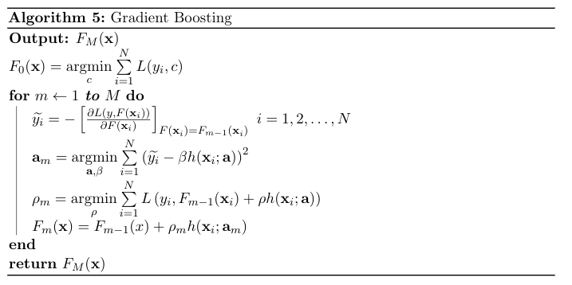
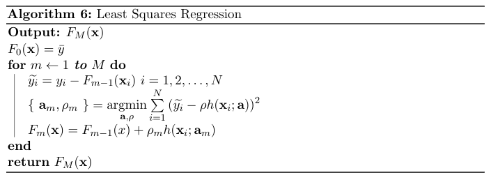
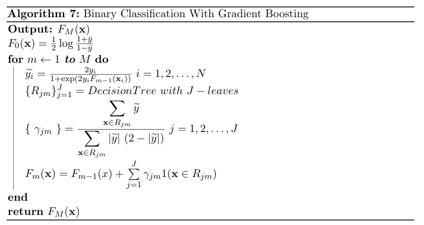

Gradient Boosting
-----------------

In a general supervised machine learning setting, we often want to find
an estimate $F(\mathbf{x})$, that produces a value $y^*$ as the
prediction to the ground truth $y$. To find the optimal $F$, we find the
function that minimizes the expected value of some pre-determined loss
function.

$$
F^* = \underset{F}{\operatorname{argmin}} \ E\_{Y | x}[L(y, F(\mathbf{x}))] \tag{14}
$$

Instead of looking at all possible functions, we usually narrow our
function space down to a family of parameterized functions
$F(\mathbf{x}; \mathbf{P})$ where $\mathbf{P}$ is a set of parameters that defines the model.

Now, the problems reduces to finding the parameters, $P^*$, that
minimizes the expected loss.

$$\begin{aligned}
                \mathbf{P^*} &= \underset{\mathbf{P}}{\operatorname{argmin}} \ E\_{Y | x}[L(y, F(\mathbf{x}; \mathbf{P}))] \\\\\\
                          &= \underset{\mathbf{P}}{\operatorname{argmin}} \ \mathbf{\Phi(\mathbf{P})}
            \end{aligned}$$

And we denote our estimated function as
$F^\* = F(\mathbf{x};\mathbf{P^*})$

### Numerical Optimization on Additive Models

Now, we restrict our attention to additive models. We define our
additive as following:

$$
F(\mathbf{x}; \{ \ \beta\_m, \mathbf{a}\_m \ \}\_{m=1}^M)
                    = \sum \limits\_{m=1}^{M} \beta\_m h(\mathbf{x}; \mathbf{a}\_m) \tag{15}
$$

So, the $\mathbf{P}$ corresponds to the parameter set
$\{ \ \beta\_m, \mathbf{a}\_m \ \}\_{m=1}^M$ and
$h(\mathbf{x}; \mathbf{a})$ is a simple model obtained by a weak
learner. We will be using small regression trees as our weak learners.
In that case, the parameters, $\mathbf{a}\_m$, corresponds to split
variables, split points and predictions at leaf (mean, median, etc. for
regression trees). And the parameter $\beta\_m$ is the weight of the weak
learner.

If we make an analogy to gradient descent, in which we make an update
with a function's steepest direction to find the point where it is
minimum:

$$x \gets x - \alpha * f^ \prime (x)$$

where $\alpha$ is the learning data.

Or if we want to find the parameters of a function where it attains its
minimum value, we make updates using a cost function
$J(\mathbf{\theta})$:

$$\theta\_i \gets \theta\_i - \alpha \frac{\partial J(\mathbf{\theta})}{\partial \theta\_i}$$

With the same logic, in Gradient Boosting, we make updates to our
additive model:

$$F\_{m}(\mathbf{x}) = F\_{m-1}(\mathbf{x}) + F\_m(\mathbf{x})$$

where $f\_m(\mathbf{x}) = -\rho_m g\_m(\mathbf{x})$ and

$$g\_m(\mathbf{x}) = \left[
                        \frac{\partial E\_y[L(y, F(\mathbf{x}) | \mathbf{x}]}{\partial F(\mathbf{x})} 
                    \right]_{F(\mathbf{x}) = F\_{m-1}(\mathbf{x})}$$

and the final solution will be:

$$F^*(\mathbf{x}) = \sum \limits\_{m=0}^{M} f\_m(\mathbf{x})$$

where $f\_0(x)$ is the initial guess.

We also find the optimum $\rho_m$ as:

$$\rho_m = \underset{\rho}{\operatorname{argmin}} \ E\_{y, \mathbf{x}} L(y, F\_{m-1}(\mathbf{x}) - \rho g\_m(\mathbf{x}))$$

### Training

This method cannot be directly applied when we have limited data because
we cannot calculate the expected loss directly. In this case, we make
use of the training set that we have.

We will use the parameterized additive model in (15) and minimize
expected loss estimated from the training set:

$$
\{ \ \beta\_m, \mathbf{a}\_m \ \} = \underset{\beta^\prime\_m, \mathbf{a}^\prime\_m}{\operatorname{argmin}} \ \sum \limits\_{i=1}^{N} L  \left( y\_i, \sum \limits\_{m=0}^{M} \beta^\prime\_m h(\mathbf{x}\_i; \mathbf{a}^\prime\_m) \right)
$$

It's often hard to find all the parameters at one step. Instead of this,
we use an iterative approach.

$$
\{ \  \beta\_m, \mathbf{a}\_m \ \} = \underset{\beta^\prime\_m, \mathbf{a}^\prime\_m}{\operatorname{argmin}} \ \sum \limits\_{i=1}^{N} L  \left( y\_i, F\_{m-1}(\mathbf{x}\_i) + \beta^\prime\_m h(\mathbf{x}\_i; \mathbf{a}^\prime\_m) \right)
$$

then we make update:

$$
F\_m(\mathbf{x}) = F\_{m-1}(\mathbf{x}) + \beta\_m h(\mathbf{x}; \mathbf{a}\_m)
$$

If you recall, this is the Forward Stagewise Additive Modelling
technique that we talked about in the previous section.

In the case where we have finite data, $g\_m$, the gradients are
calculated for the training data instances $\{ \mathbf{x}\_i \}\_{i=1}^N$:

$$
g\_m(\mathbf{x}\_i) = \left[
                            \frac{\partial L(y, F(\mathbf{x}\_i) }{\partial F(\mathbf{x}\_i)} 
                        \right]_{F(\mathbf{x}) = F\_{m-1}(\mathbf{x})}
$$

But we cannot calculate the gradients directly for new data points other
than the ones in the training set. And even if for training set, if we
use the gradients directly, the model would not be well generalized.
Therefore, we need our model to learn a mapping from training data
points to gradients in order to generalize to unseen data. To do that,
we use a parameterized function and that is the
$h(\mathbf{x}; \mathbf{a})$, as we mentioned and learn its parameters,
$\mathbf{a}$, as given below:

$$
{ \ \mathbf{a}\_m \ } =  \underset{\mathbf{a}}
                        {\operatorname{argmin}} \ \sum \limits\_{i=1}^N (-g\_m(\mathbf{x}\_i) - \beta h(\mathbf{x}\_i; \mathbf{a} )) \tag{16}
$$

So, we fit the negative gradients, $-g\_m$, to the parameterized model
$h(\mathbf{x}; \mathbf{a})$ to learn a mapping from the obversations to
its gradients. Negative gradients are also called \"pseudo-responses\",
in the sense that, we try to learn a mapping to them even though they
are not the real response values. And they are also called
\"pseudo-residuals\" as well.

Therefore, we have a general algorithm that we will work for any
differentible loss function. At each stage of the algorithm we learn a
mapping from data points to gradients. This is analogous to the standard
applications of gradient descent in machine learning where the
parameters of a function is learned.

### Applications of Gradient Boosting

Let us derive some algorithms for common tasks such as regression and
classification using the Gradient Boosting methodology that is presented
in the previous section.

### Least Squares Regression

We define the loss function for least squares regression as
$L(y, F) = \frac{(y-F)^2}{2}$, the squared error. Pseudo-responses are
derivative of this loss function. So, $\widetilde{y}$ is simply $y - F$.
Our initials guess will be $F\_0(\mathbf{x}) = \bar{y}$, namely the mean
of the target values, because squared error is minimized at the mean.
With these, we can build our least squares regression with Gradient
Boosting algorithm.

### Binary Classification

In the case of binary classification, we have negative binomial
log-likelihood as the loss function:

$$
L(y, F) = - (y \log p + (1-y) \log (1-p))
$$

where $y \in \{ -1, 1 \}$. $p$ is related to $F$ through:

$$p(y = 1 | \mathbf{x}) = \frac{1}{1 + e^{-F(\mathbf{x})}}$$

Pulling out $F$ from this equation, we find:

$$F(\mathbf{x}) = \frac{1}{2} \log \left[ \frac{P(y = 1 | \mathbf{x})}{P(y = -1 | \mathbf{x})} \right]$$

With some algebraic manipulation, we can write the same loss function
using only $y$ and $F$:

$$L(y, F) = \log( 1 + \exp(-2yF) )$$

Taking derivative with respect to $F$, we find the pseudo-response:

$$\widetilde{y\_i} = - \left[  \frac{\partial{L(y\_i, F(\mathbf{x}\_i))}}{F(\mathbf{x}\_i)}  \right]_{F(\mathbf{x}) = F\_{m-1}(\mathbf{x}\_i)}
                    = \frac{2y\_i}{1 + \exp(2y\_iF\_{m-1}(\mathbf{x}\_i))} \tag{17}$$

where $i = 1, 2, \dots, N$

We will use regression trees as our base learners to learn a mapping to
these pseudo-responses. After building the regression tree, predictions
in the leaves, $R\_{jm}$, is the solution of this objectve:

$$\gamma\_{jm} = \underset{\gamma}
                    {\operatorname{argmin}} \sum \limits\_{ \mathbf{x} \in R\_{jm} } \log \left(  1 + \exp(-2y\_i(F\_{m-1}(\mathbf{x}) + \gamma))  \right) \tag{18}$$

We can't directly solve this equation. Instead, we will estimate it with
a single Newton-Raphson step. For that, we need to find the first and
second derivative of:

$$H(\gamma; R\_{jm}) =  \sum \limits\_{ \mathbf{x} \in R\_{jm} } \log \left(  1 + \exp(-2y\_i(F\_{m-1}(\mathbf{x}) + \gamma) \right)) \tag{19}$$

1-step Newton-Raphson approximation of gamma with initial value 0 is:

$$\begin{aligned}
                    \gamma &= \gamma\_0 - \frac{H^\prime(\gamma\_0)}{H^{\prime\prime}(\gamma\_0)} \\\\\\
                            &= 0 - \frac{H^\prime(0)}{H^{\prime\prime}(0)} \\\\\\
                            &= - \frac{H^\prime(0)}{H^{\prime\prime}(0)}
                \end{aligned}$$

First derivative of $H$ is:

$$H^\prime(\gamma) = \sum \limits\_{ \mathbf{x} \in R\_{jm} }  \frac{-2y\_i}{1 + \exp(2y\_i(F\_{m-1}(\mathbf{x}\_i) + \gamma))} \tag{20}$$

And at $\gamma = 0$:

$$\begin{aligned}
                    H^\prime(0) &= \sum \limits\_{ \mathbf{x} \in R\_{jm} }  \frac{-2y\_i}{1 + \exp(2y\_iF\_{m-1}(\mathbf{x}\_i))}
                \end{aligned}$$

We can see this equation is equal to negative of $\widetilde{y}$ (see
equation (17)). So:

$$H^\prime(\gamma) = -\sum \limits\_{ \mathbf{x} \in R\_{jm} }  \widetilde{y\_i} \tag{21}$$

Second derivative of $H$ can be found by taking derivative of (19) with
respect to $\gamma$ again:

$$\begin{aligned}
                    H^{\prime\prime}(\gamma) &= \sum \limits\_{ \mathbf{x} \in R\_{jm} } \frac{d}{d\gamma} H^\prime(\gamma) \\\\\\
                        &= \sum \limits\_{ \mathbf{x} \in R\_{jm} } \frac{
                            (-2y\_i)  2y\_i  \exp({2y\_iF\_{m-1}(\mathbf{x})})
                        }{                      
                            \left( 1 + \exp({ 2y\_i (F\_{m-1}(\mathbf{x}) + \gamma) }) \right)^2
                        } \\\\\\
                        &= \sum \limits\_{ \mathbf{x} \in R\_{jm} }  - \widetilde{y} \ . \ \widetilde{y} \ . \ exp(2y\_iF\_{m-1}(\mathbf{x})) \\\\\\
                        &= \sum \limits\_{ \mathbf{x} \in R\_{jm} }  - \widetilde{y} \ . \ \widetilde{y} \ . \ \frac{(2y - \widetilde{y})}{\widetilde{y}} \\\\\\
                        &= \sum \limits\_{ \mathbf{x} \in R\_{jm} }  \widetilde{y} (\widetilde{y} - 2y)
                \end{aligned}$$

We can simplify this a little bit further. We can see that, from the
equation (17), $y$ and $\widetilde{y}$ always has the same sign. So, the
product $y \ . \ \widetilde{y}$ equals to $| \widetilde{y} |$.

Therefore, the second derivative equals to:

$$H^{\prime\prime}(\gamma) = \sum \limits\_{ \mathbf{x} \in R\_{jm} }  |\widetilde{y}| \  (|\widetilde{y}| - 2) \tag{22}$$

Being calculated the first and second derivatives, we can find our
1-step Newton-Raphson approximation of $\gamma$:

$$\begin{aligned}
                    \gamma\_{jm} &= - \frac{H^\prime(0)}{H^{\prime\prime}(0)} \\\\\\
                           &=  -\frac{ \displaystyle{
                            \sum \limits\_{ \mathbf{x} \in R\_{jm} }  \widetilde{y}
                           } }
                           {
                                \displaystyle{
                                    \sum \limits\_{ \mathbf{x} \in R\_{jm} }  |\widetilde{y}| \  (|\widetilde{y}| - 2)
                                }
                           } \\\\\\
                \end{aligned} $$

$$
  \gamma\_{jm}     =     \frac{ \displaystyle{
                            \sum \limits\_{ \mathbf{x} \in R\_{jm} }  \widetilde{y}
                           } }
                           {
                                \displaystyle{
                                    \sum \limits\_{ \mathbf{x} \in R\_{jm} }  |\widetilde{y}| \  (2 - |\widetilde{y}|)
                                }
                           }  \tag{23}
$$

By using (23), we can label the leaves of the decision tree that was
built in mth iteration.

Finally, we must derive an initial prediction, $F\_0(\mathbf{x})$. One
can easily show that the negative binomial log-likelihood is minimized
at:

$$F\_0(\mathbf{x}) = \frac{1}{2} \log \left(\frac{ \displaystyle{
                            \sum \limits\_{i=1}^N 1(y\_i=1)
                    } }{
                        \displaystyle{
                            \sum \limits\_{i=1}^N 1(y\_i=-1)
                        }
                    }
                    \right) \tag{24}$$

Notice that we used $\frac{1}{N} \sum \limits\_{i=1}^N 1(y\_i=1)$ as an
estimate for $P(y = 1 | \mathbf{x})$. Similarly
$\frac{1}{N} \sum \limits\_{i=1}^N 1(y\_i=-1)$ is an estimate for
$P(y = -1 | \mathbf{x})$. By using these estimates, we came up with
(24).

Note that the $F\_0$ is refers to a constant value that minimizes cost

Equation above becames a lot clear if we used
$\bar{y} = \frac{1}{N} \sum \limits\_{i=1}^N y\_i$:

$$F\_0(\mathbf{x}) = \frac{1}{2} \log \frac{1+\bar{y}}{1-\bar{y}} \tag{25}$$

Following the same logic, any learning task with any differentiable loss
function $L$ and base learner $h$, can be done with Gradient Boosting
algorithm presented in Algorithm 5.

### Regularization

Usually, we don't want our learning algorithm to \"overlearn\" our
training set. Instead, we want them to generalize and have high
performance on unseen data as well as training data. If a learning
algorithm performs almost perfect on training data but perform poorly on
a separate validation set, then that algorithm is said to be overfit.
There are techniques to overcome this problem of overfitting. They are
called regularization techniques. Regularization techniques differs from
algorithm to algorithm.

For example, in gradient descent, we regularize our model by tuning the
learning rate parameter or number of iterations. Learning rate is the
shrinkage parameter applied on the gradients of the cost function.

In Gradient Boosting, we train $M$ base learner to learn a mapping to
gradients. Then update our model with these gradients. So, one natural
regularization technique is tuning the $M$ parameter. Other one is
bringing a new learning rate parameter $\nu$, to the model. We can
modify our model update equation with this learning rate parameter as
the following:

$F\_m(\mathbf{x}) = F\_{m-1}(x) + \nu \ . \ \rho_m h(\mathbf{x}\_i; \mathbf{a}\_m)$

By using a learning rate, we reduce the influence of a single base
learner to leave some room for other base learners to improve the model.

There are other effective regularization techniques that are used by
popular Gradient Boosting libraries such as XGBoost, LightGBM, Catboost,
etc. Popular ones includes maximum features to use at each iteration
(this is similar to Random Forest), subsampling the training set at each
iteration and maximum depth of each tree, etc.

In the next section, we will discuss these popular algorithms that uses
the Gradient Boosting concept.

XGBoost
-------

In recent years, several Gradient Boosting algorithms has been
developed. With these algorithms, Gradient Boosting became much more
scalable and computationally efficient. In Gradient Boosted Decision
Trees, most computationally expensive part is the tree building process.
For each non-terminal node, a split criterion must be found by looking
at all possible splits of each feature. This process is really slows
down the training of Gradient Boosted Decision Trees. If we have lots of
features and lots of data, even one step of Gradient Boosting takes an
unreasonable amount of time. Recently developed algorithms address this
problem and gives efficient solutions.

One popular Gradient Boosting franework is XGBoost. It was initially
developed in 2014. It uses a modified cost function that has an
additional regularization term which penalizes the complexity of the
trees. Besides that, it addresses computational problems that arise when
using Gradient Boosting in large data sets by proposing several
solutions.

### Regularized Cost Function

As we seen on the previous chapter, given a loss function, $L$, we
define our objective (cost function) as:

$$\sum \limits\_{i=1}^N L(y\_i, F\_{m}(\mathbf{x}\_i))$$

XGBoost proposes a modified version of this objective that takes
regularization into account:

$$\mathcal{L} = \sum \limits\_{i=1}^N L(y\_i, F\_{M}(\mathbf{x}\_i)) + \sum \limits\_{k = 1}^M \Omega (f\_k) \tag{26}$$

where
$\Omega(f) = \displaystyle{\gamma T + \frac{1}{2} \lambda \sum \limits\_{j=1}^T {w_j}^2}$.
$T$ is the number of leaves in the tree $f$ and $w_j$ is the score in
jth leaf. $\gamma$ and $\lambda$ are regularization parameters.

This objective minimizes the loss of the final model $F\_M$ with $M$
trees. However, in practice, it's impossible to find $M$ trees in only
one step. We need a greedy approach that adds the trees in an iterative
fashion. So, at iteration m, we need to solve the objective:

$$\mathcal{L}^{(m)} = \sum \limits\_{i=1}^N L(y\_i, F\_{m-1}(\mathbf{x}\_i) + f\_m(\mathbf{x}\_i)) + \Omega (f\_m) \tag{27}$$

Assuming that $L$ is a twice differentiable function, we approximate the
$L$ function by second order Taylor polynomial.

$$\mathcal{L}^{(m)} = \sum \limits\_{i=1}^N \left[
                L(y\_i, F\_{m-1}(\mathbf{x}\_i)) + g(\mathbf{x}\_i)f\_m(\mathbf{x}\_i) + \frac{1}{2} h(\mathbf{x}\_i)f\_m^2(\mathbf{x}\_i)
            \right]  + \Omega (f\_m) \tag{28}$$

where $$g(\mathbf{x}) = 
                \frac{
                    \partial L(y\_i, F\_{m-1}(\mathbf{x}))
                }{
                    \partial F\_{m-1}(\mathbf{x})
                }$$ and

$$h(\mathbf{x}) = 
                \frac{
                    \partial {L(y\_i, F\_{m-1}(\mathbf{x}))}^2
                }{
                    \partial^2 F\_{m-1}(\mathbf{x})
                }$$

This equation can be simplified by removing the constant terms.

$$\mathcal{\tilde{L}}^{(m)} = \sum \limits\_{i=1}^N \left[
                g(\mathbf{x}\_i)f\_m(\mathbf{x}\_i) + \frac{1}{2} h(\mathbf{x}\_i)f\_m^2(\mathbf{x}\_i)
            \right]  + \Omega (f\_m)$$

$$\mathcal{\tilde{L}}^{(m)} = \sum \limits\_{i=1}^N \left[
                g(\mathbf{x}\_i)f\_m(\mathbf{x}\_i) + \frac{1}{2} h(\mathbf{x}\_i)f\_m^2(\mathbf{x}\_i)
            \right]  + \gamma T + \frac{1}{2} \lambda \sum \limits\_{j=1}^T {w_j}^2$$

To simplify this equation further, we can group the summations to be
based on the points in the same leaf. Recall that we can define the
$f\_m$ as:

$$f\_m(\mathbf{x}) = \sum \limits\_{j=1}^T w_j 1(\mathbf{x} \in R\_j)$$

Using that definition of $f\_t$, we can simplify our objective:

$$\begin{aligned}
            \mathcal{\tilde{L}}^{(m)} 
            &= \sum \limits\_{j=1}^T 
             \left[
                \sum \limits\_{\mathbf{x}\_i \in R\_j}
                g(\mathbf{x}\_i)w_j + \frac{1}{2}\sum \limits\_{\mathbf{x}\_i \in R\_j}  h(\mathbf{x}\_i)w_j^2
            \right]  + \gamma T + \frac{1}{2} \lambda   \sum \limits\_{j=1}^T  {w_j}^2 \\\\\\
            &= \sum \limits\_{j=1}^T 
             \left[
                \sum \limits\_{\mathbf{x}\_i \in R\_j}
                g(\mathbf{x}\_i)w_j + \frac{1}{2}
                \left( \sum \limits\_{\mathbf{x}\_i \in R\_j}   h(\mathbf{x}\_i) + \lambda \right) w_j^2
            \right]  + \gamma T
        \end{aligned}$$

We need to find $w_j$'s that need minimize this equation. Taking
derivative with respect to $w_j$, we can find the optimum $w_j$:

$$w_j^* = - \frac{
                \displaystyle{
                    \sum \limits\_{\mathbf{x}\_i \in R\_j}
                    g(\mathbf{x}\_i)
                }
            }{
                \displaystyle{
                    \sum \limits\_{\mathbf{x}\_i \in R\_j}   h(\mathbf{x}\_i) + \lambda
                }
            } \tag{29}$$

Using these $w_j$'s, we can find the optimum cost value:

$$\mathcal{\tilde{L}}^{(m)^*}  = -\frac{1}{2} \sum \limits\_{j=1}^T 
            \frac{
                \displaystyle{
                    \left(
                        \sum \limits\_{\mathbf{x}\_i \in R\_j}
                        g(\mathbf{x}\_i)
                    \right)^2
                }
            }{
                \displaystyle{
                    \sum \limits\_{\mathbf{x}\_i \in R\_j}   h(\mathbf{x}\_i) + \lambda
                }
            }  + \gamma T \tag{30}$$

We can use this equation as a scoring function when deciding on split
criteria. As discussed in Decision Trees chapter, when we looking for
the best split across all feature space, we choose the feature and the
split point that gives the most reduction in our impurity. Likewise,
XGBoost chooses the split crtierion that results in most reduction in
the cost (28).

If a region $R$ is splitted into two regions $R\_L$ and $R\_R$, then the
reduction in the cost after the split is given by:

$$\mathcal{\tilde{L}}^{(m)^*} = \frac{1}{2} \left[
                \frac{
                    (
                        \sum \limits\_{\mathbf{x}\_i \in R\_L}
                        g(\mathbf{x}\_i)
                    )^2
                }{
                    \sum \limits\_{\mathbf{x}\_i \in R\_L}   h(\mathbf{x}\_i) + \lambda
                } +
                \frac{
                    (
                        \sum \limits\_{\mathbf{x}\_i \in R\_R}
                        g(\mathbf{x}\_i)
                    )^2
                }{
                    \sum \limits\_{\mathbf{x}\_i \in R\_R}   h(\mathbf{x}\_i) + \lambda
                } -
                \frac{
                    (
                        \sum \limits\_{\mathbf{x}\_i \in R}
                        g(\mathbf{x}\_i)
                    )^2
                }{
                    \sum \limits\_{\mathbf{x}\_i \in R}   h(\mathbf{x}\_i) + \lambda
                }   
            \right] - \gamma \tag{31}$$

### Split Finding

As we discussed in the previous chapter, split finding is arguably the
most computationally expensive part of the Decision Tree algorithm. To
find the best split for a specific node, we need to iterate over all
features and sort their values, and search for the values that gives the
best split according to some impurity measure like gini index, cross
entropy or cost reduction like (31). This algorithm is called the Exact
Greedy Algorithm. In settings where we have millions or billions of data
points, this solution becomes infeasible.

Instead, XGBoost proposes several algorithms for avoiding the
disadvantages of Exact Greedy Algorithm for split finding.

### Approximate Algorithm

Exact Greedy algorithm needs to enumerate over all values of a feature
in one step and it needs to repeat that for all features. To avoid the
computational cost of this process, XGBoost proposes an algorithm called
Approximate Algorithm. What it does is, instead of looking at every
value of a feature, it finds $l$ percentile of a feature, based on its
values in the training set. Then, it iterates over these $l$ different
percentiles to find the best possible split amongst these percentiles,
instead of looking at $N_k  \approx N$ different values of a feature. As
the Exact Greedy algorithm, Approximate Algorithm does this step for
every features.

### Sparsity-aware Split Finding

There can be a lot of sparse features in large data sets. This sparsity
in the data slows down the split finding process. XGBoost proposes a
Sparsity-aware Split Finding algorithm. It gives a default direction
(left or right) to which a way the missing values in the feature to go
while splitting the node. It finds the best direction from the data by
looking at only the non-missing values and calculating the cost
reduction in each direction.

There are also low level optimizations XGBoost performs that speeds up
the tree learning process. Its paper explains them in detail.
