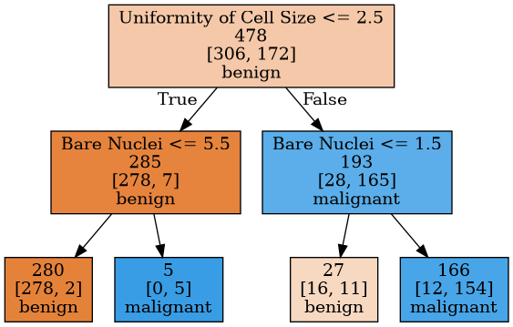
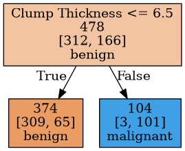
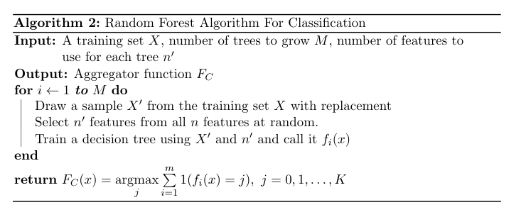

Introduction
============

Tree based methods are used across many Machine Learning tasks. They are
favored because of their interpretability and their ability in capturing
non-linear relationships in the data. Decision tree is simplest among
all tree based models. It's very interpretable and straightforward. But
it has its disadvantages. Because of its non-parametric nature, it
heavily relies on data. Different data may result in completely
different trees in the tree building process. This problem is referred
as 'a model having high variance'. For this reason, decision trees are
non-stable models. They usually fail to generalize, therefore perform
poorly on unseen data. In another words, they overfit.

Ensemble methods overcome this issue by combining multiple trees
(learners, generally) into a robust model that generalizes well and have
high performance on unseen data. They achieve this by reducing the bias
(it can be seen as a model's 'unability' of capturing the complexity of
the data) or reducing the variance of a model.

In this article, we'll talk about decision trees and ensemble methods
that uses decision trees in the context of classification.

Decision Trees
==============

What is a Decision Tree?
------------------------

Decision trees can seen as a set of if-then rules. Starting from a root
node, at each node, a decision is made. Data is splitted to different
branches at each decision. At the bottom of the tree, there are leaves.
Each member of the data eventually reaches a leaf. At each leaf, a final
prediction is made. For example, if we're trying to predict house
prices, prediction at a leaf may be the mean (or median) of all house
prices in that leaf. If we are making a classification, such as
classifying some pictures as cats and dogs, then prediction at a leaf is
taking the most common class in that leaf.\

*Figure 1: A Simple Decision Tree*

In Figure 1, there is a decision tree built based on
Wisconsin Breast Cancer dataset from UCI Machine Learning Repository. At
each node, there is a condition that splits the data, for example
'Uniformity of Cell Size $\leq$ 2.5' or 'Bare Nuclei $\leq$ 1.5'. Nodes
at the bottom are leaves that's classifying the tumors that reaches them
as benign or malignant.

We see that, at the left most leaf, there are $278+2=280$ members (tumor
records). These are from training data that the tree is built from. The
model classified this leaf as benign because the majority class was
benign. Every new observation that falls into that leaf will be
classified as benign. 280 members of the training data reached this
leaf. 278 of them were benign and 2 of them were malignant. So, it's
logical to label this leaf as benign because it's the majority class. On
the other hand, second leaf from the right does not look good. There are
16 benign and 11 malignant tumors that fell into that leaf and because
we label the leaf as whatever the majority class is, it's been labeled
as benign. But the frequencies of benign and malignant are very close.
The node is non-homogeneous. Maybe it needed further splits.

Another thing that we might have been asked is, in the root node, for
example, how did we decide to split the node by the condition
'Uniformity of Cell Size $\leq$ 2.5'? How did we determine that 2.5
boundary? There must be some mechanism that help us decide the 'best
split' in a specific node.

So, there should be two important aspects to consider in tree building
process. At each node, we check if it might be a good idea to split that
node further and find what is the best possible split criterion that
creates homogeneous (pure) child nodes.

How can we measure the impurity of a node? One possible measurement is
*cross-entropy*, which is defined as:
$$
\sum \limits\_{i=1}^{K} - p\_i \log p\_i \tag{1}
$$

where K is the number of classes, 2 for the tumor case. $p\_i$ is the
proportion of class $i$ in the node and defined as:
$$p\_i  = \frac{N\_i}{N}$$ where $N\_i$ is the number of members that
belong to class $i$ in the node and $N$ is total members in the node.

Another impurity function is *gini coefficient*:
$$1  -  \sum \limits\_{i=1}^{K} p\_i^2 \tag{2}$$ 

So, we calculate the impurity of a node by an impurity measurement
function. We want to create pure leaf nodes. To do that, we must select
at each splitting stage, the split that reduces the impurity most. We
need to calculate the impurity after the split.

Suppose that a splitting criterion, $C\_i$, splits a node into $n$ nodes.
Choosing the cross-entropy as our impurity measure, impurity after the
split is defined as:
$$
\displaystyle{ \mathrm{I'} = - \sum \limits\_{j=1}^{n} \frac{N\_j}{N} \sum \limits\_{i=1}^{K} p\_{ij} \log p\_{ij} } \tag{3}
$$

We choose the split, $C$, that reduces the cross-entropy most. In other
words, at a node m, we're looking for a $C$ that maximizes the
cross-entropy decrease, which is defined as:
$$
\displaystyle{ D(m) =\mathrm{ I_m }- \mathrm{I^{'}\_m} } \tag{4}
$$

where $\mathrm{I_m}$ is from $(1)$ and $\mathrm{I'_m}$ is from $(3)$.
They are calculated based on the node m.

With these fundamental ideas in our mind, let us further explore
decision trees by looking at the tree building process.

How to Build a Decision Tree
----------------------------

There are different algorithms for decision tree building. But their
core ideas are same. They only differ in data type treatment, tree
structure and some additional heuristics.

Suppose that we have $n$ explanatory variables. If an explanatory
variable $x\_i$ is categorical and has $M$ distinct values, there are
$2^{M-1}-1$ different splits. An example split would be
$C(m) = 1(x\_i = m)$ where $m$ is a possible value that $x\_i$ can have.
$1(.)$ is the indicator function that returns 0 or 1 based on the
boolean expression that it receives as argument. So, the example split,
splits the node into two different sets. Therefore, it creates a two
different node. If $x\_i$ is a numerical (continuous) variable, it can
have infinite number of values. But because we can not search for every
possible numerical value, we look for the boundary values in our
training data. So, that leaves us out with $M-1$ possible splits. For
example, suppose that we have a training set that contains $N$ records
and suppose that we have an explanatory variable $x\_i$ and has values
$S\_i = \{ x\_i^{(j)}\}\_{j=1}^{N}$ such that $S\_i$ is sorted. We check the
possible splits, $C\_i(m) = 1(x\_i < m)$ where
$\displaystyle{m=\frac{ x\_i^{(j)} + x\_i^{(j+1)} }{2}}, j=0,1,2,...,m-1$.
This form of split, again, splits a set into two distinct sets. These
are the basic splitting criteria that we will use.

Let us start with the simplest one, the CART algorithm. CART uses the
gini index as splitting criterion. Also, CART treats every variable as
numerical. So, it always look for split in the form $C(m) = 1(x<m)$.
Hence, it always does binary splitting. So, it creates binary trees.
Starting from a single node, for each variable, it finds the best split
$C\_i(m)$, and selects the best split among these variables. In another
words, it selects the split that maximizes the impurity decrease from
$(2)$. And it recursively repeats this process until there is no
decrease in the impurity or the impurity of the current node is less
than some threshold value.

Basic CART algorithm is given above. Only one stopping criterion is
given in the algorithm. It stops when the current node's impurity is
less than or equal to some user-defined threshold. But there are other
stopping criteria as well. For example, enforcing a maximum depth to the
tree. When the tree reaches to a specified maximum depth, the algorithm
stops. Or specifying the minimum members at a node to make it a leaf.
When a node has less than or equal number of members inside it, the
algorithm stops. These stopping criteria prevents the tree from growing
too large. Consequently, prevents overfitting. These criteria often
referred as *pre-pruning*, meaning that pruning the tree while building
it. There are also *post-pruning* techniques which prunes the free after
it is grown. We won't discuss post-pruning in this article.

Other Algorithms for Tree Building
----------------------------------

There are other decision tree building algorithms besides CART. Some
examples are *ID3*, *C4.5*, *C5.0*, etc,. For example, C4.5 treats
categorical and numerical variables differently. It does binary
splitting for numerical variables by finding a threshold as in CART. It
does K-way splitting for categorical variables that can have K distinct
values. Also, it uses cross-entropy as splitting criterion.

Now, let us discuss how to fully exploit decision trees by applying
ensemble methods.

Ensemble Learning
=================

Basic idea behind the ensemble learning is combining multiple base
learners to create a powerful model that has higher performance than
each individual learner's performance. There are two popular methods for
ensemble learning: *bagging* and *boosting*. Bagging works by training
multiple learners on a sample drawn from the training set. And in
prediction time, it takes the average of each learner's prediction (for
regression) or it take the majority vote (for classification). Boosting
has a different approach. It starts with a 'weak learner' that performs
slightly better than random guessing. And it iteratively adds new weak
learners to the model to fix the errors that the previous learners made.

*Figure 2: A Decision Stump*

Decision trees are often used as base learners in ensemble methods. In
bagging, multiple large trees with high variance are trained on
different samples of the training set in order to create a robust model
that has low variance. In boosting, decision stumps or small trees are
often used as high biased learners. A decision stump is a decision tree
which goes only one level deep. It does only one decision. In Figure 2,
there is an example decision stump built from wisconsin breast cancer
data set. It only uses the feature 'Clump Thickness' and makes a single
split.

Bagging
-------

The term bagging stands for '*bootstrap aggregation*'. Let's define
*bootstrapping* and *aggregating*. Bootstrapping is any method that uses
*random sampling with replacement*, which means some sample may have
repeated observations. Aggregating means combining the results taken
from the different samples.. In the regression case, 'combining' means
is taking the average of the results (5). In classification, it means
taking the majority vote (6). It turns out that taking bunch of samples
with replacement, training some models on them and aggregating the
results has a variance reducing effect. Therefore, by bagging, a model
with low variance model can be obtained by using high variance models.
$$F\_R(x) = \frac{1}{m}  \sum \limits\_{i=1}^{m} f\_i(x) \tag{5}$$

$$F\_C(x) = \underset{j}{\operatorname{argmax}}   \sum \limits\_{i=1}^{m} 1(f\_i(x) = j), \ j = 0, 1, \dots, K \tag{6}$$

m is the number of trained models.

Random Forest
-------------

Random Forest is an ensemble learning algorithm that leverages bagging
and decision trees. Decision trees are great choice for ensemble methods
because they usually have high variance. Multiple decision trees can be
used together to both reduce their individual variances and make use of
their power in capturing non-linear relationships in the data.

Besides using decision trees, Random Forest does more one thing to
create less correlated tree to reach more predictive performance. If
some features in our data set are more correlated with our target
features, then every decision trees will use those features to make
prediction and therefore, all the trees will be correlated with one
another. So, we would end up with trees that are mostly identical to
another and our overall model would have low performance. What Random
Forest does to prevent this problem is this: For each tree, it uses only
a portion of the features in the data set rather using all features.
Number of trees and number of features to uses at each tree building
process are hyperparameters to tune.

Resources
=========

In this section, I'll give the resources I used while preparing this
article that consists of three part.

You can download the Wisconsin Breast Cancer Data Set from here:
<https://archive.ics.uci.edu/ml/datasets/Breast+Cancer+Wisconsin+(Diagnostic)>.

Ethem Alpaydın's Introduction to Machine Learning book has a great
Decision Tree chapter that gives a solid introduction. Stanford
University's [CS229](http://cs229.stanford.edu/syllabus-autumn2018.html)
course has useful material in various topics including Decision Trees,
Random Forest, Boosting, etc.

A couple of detailed material about CART can be found from these links:
[1](ftp://ftp.boulder.ibm.com/software/analytics/spss/support/Stats/Docs/Statistics/Algorithms/14.0/TREE-CART.pdf)
[2](https://rafalab.github.io/pages/649/section-11.pdf)

Elements Of Statistical Learning book by Trevor Hastie, Robert
Tibshirani, Jerome H. Friedman is a great book that covers lots of
topics in Machine Learning. It has separate dedicated chapters about the
topics covered in this article and it gives clear, detailed explanations
about these topics.

Jerome H. Friedman's Greedy Function Approximation: Gradient Boosting
Machine paper gives a thorough description of Gradient Boosting
algorithm and derives several algorithms using Gradient Boosting.

XGBoost: A Scalable Tree Boosting System paper by Tianqi Chen and Carlos
Guestrin describes the XGBoost framework. Interested readers are
encouraged to read it if they want to learn about what optimizations
XGBoost does more deeply.

Python Implementation
=========

You can check the Python implementations of the algorithms that are covered in this post and the two of the upcoming posts in this repo: [Tree Based Methods](https://github.com/tugrulhkarabulut/Tree-Based-Methods). You can also obtain the pdf version of these 3 posts in the repo.
